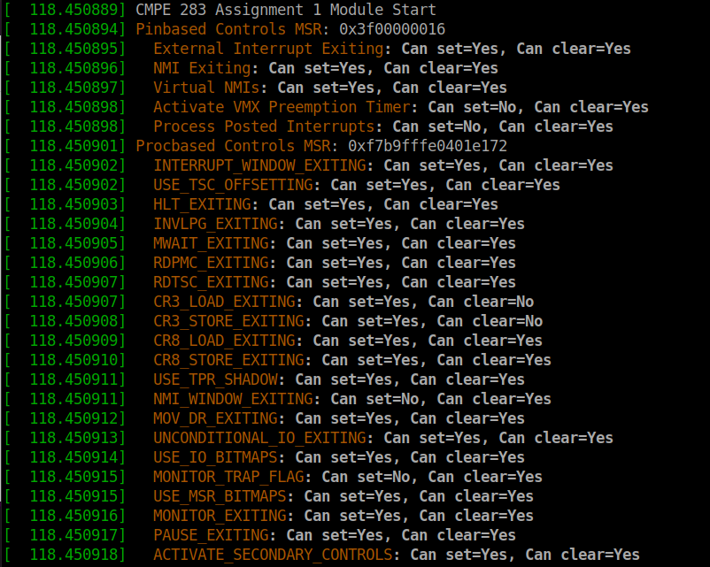
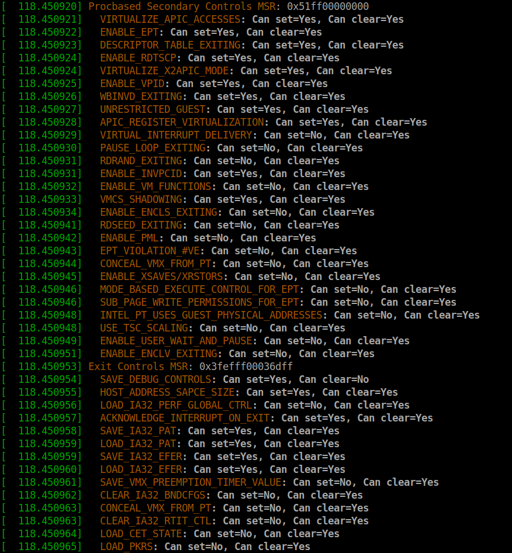
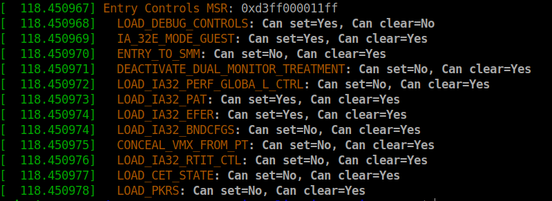

## Questions for assignment01:

Team Member: Rui

1. Did assignment by myself
2. Steps for me to finish this assignment:  
    1. Configuare a GCP vm that has the VMX enable
    2. Download the cmpe283.c file source and MakeFile files
    3. make sure to have make tool and gcc compiler on your VM
        1. run(all commands are run in terminal)   
            ```sudo apt install gcc make```
    4. There are 5 total features that we are trying to detect base on our GCP VM.
        1. Pinbased(provided by professor Mike as codebase)
        2. probased, probased02, exit,entry (write my own strcuts for these four base on MSR index, and info on SDM, Volume 3 ch.24)
    5. run under the same directory with MakeFile and cmpe283.c file in terminal  
        ```make```
        1. couple .o/.ko files will be generated
    6. use insmod/rmmod tool to insert and remove module  
        ```insmod/rmmod cmpe283.ko```
    7. use dmesg tool to print  
        run ```dmesg```
    8. By here we sould be able to see the message outputs for pinbased, probased, probased02, exit, entry features on terminal
    
    
   
   ## Sample Outputs:
   
   
   
          
