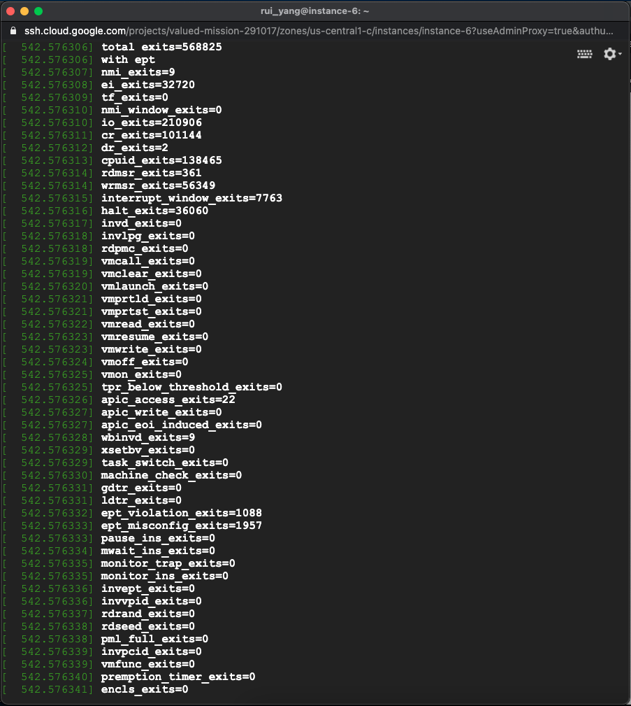

# Details of assignment04
This readme file contains the answers to Questions

# Questions

## Q1
ANS: I did this lab by myslef  
## Q2
Q:Include a sample of your print of exit count output from dmesg from “with ept” and “without ept”.  
Ans: For somehow reason, my google cloud vm will crash everytime when I insmod the /lib/modules/my_version/../kvm-intel.ko even if I have a working assignment03 and follow your instrcutions. I am not sure where I did wrong. Anyway, I am only able to provide the output for the ept.
  

## Q3
Q:What did you learn from the count of exits? Was the count what you expected? If not, why not?  
Ans: Although I do not have the sample output for no-ept, I think I am still able to answer this question. We should expect that the total exits with shadow paging architecture are double or even triple more than the total exits in nested paging architecture.  This is due to the shadow paging architecture requires more exits to perform correctly as a  VMM. 

## Q4
Q:What changed between the two runs (ept vs no-ept)?  
Ans: What happened between them was that the no-ept turn on more exits for each memory access. For example, load/read/write to %cr3 register, #PF, and any operations that involve in TLB flush. These exit controls must be turned on for each memory access to work correctly in a shadow paging architecture. Whereas, in nested paging architecture, the VMM does not care about all these instructions because the VMM guard the second translation of each memory access. VMM requires the #NPF exit control to turn on when using nested paging architecture.   
